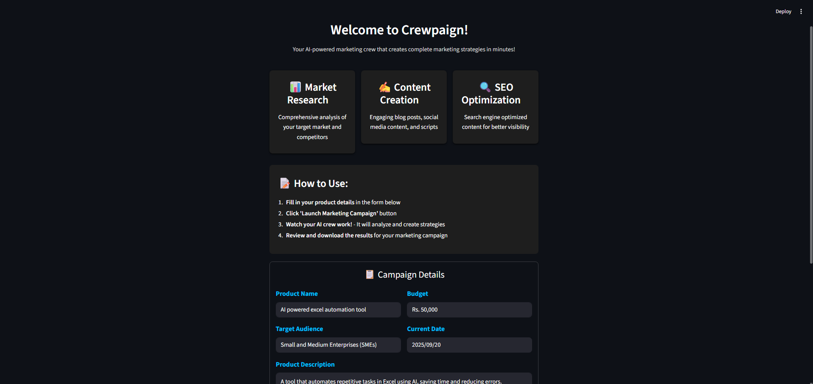

# 📈 Crewpaign – Your AI-Powered Marketing Crew

Crewpaign is a **Streamlit + CrewAI application** that helps you design and launch AI-powered marketing campaigns with just a few inputs.  
Whether you're an **entrepreneur, startup, SME, or agency** – Crewpaign builds strategies, content, SEO plans, and more **in minutes**.  

## ✨ Key Features

- 📊 **Market Research** → In-depth analysis of audiences, competitors, and trends  
- ✍️ **Content Creation** → Blogs, social media posts, and video scripts  
- 🔍 **SEO Optimization** → Keyword-driven, search-engine-optimized content  
- ⚡ **One-Click Campaign Launch** → Enter details → Get results → Download instantly  

# Project Demo

## UI Preview

  

## 💻 Tech Stack

- **Python 3.11**  
- **Streamlit** – sleek UI design  
- **CrewAI** – multi-agent orchestration  
- **ScrapingDog** – web data extraction  
- **Google Gemini** – AI-powered intelligence  

## ⚡ How It Works

1. Enter your **product name, target audience, budget, and description**  
2. Click **"🚀 Launch Marketing Campaign"**  
3. AI agents collaborate to design a **complete strategy**  
4. 🎉 **Get strategies** instantly to your system  

## 🎯 Use Cases

- **Startups** → Rapid marketing strategy development  
- **SMEs** → Cost-effective campaign planning  
- **Agencies** → Quick campaign prototyping for clients  
- **Entrepreneurs** → Product launch preparation  
- **Content Teams** → Idea generation & campaign content  

---

## 🤖 AI Crew in Action

- 🧑‍💼 **Head of Marketing** → Market research & strategy  
- ✍️ **Content Creator** → Social posts & campaign drafts  
- 📝 **Content Writer** → Blogs & long-form content  
- 🔍 **SEO Specialist** → Keyword planning & optimization  

---

## 👩‍💻 Author

Built with ❤️ by [Kabshah](https://github.com/Kabshah)  